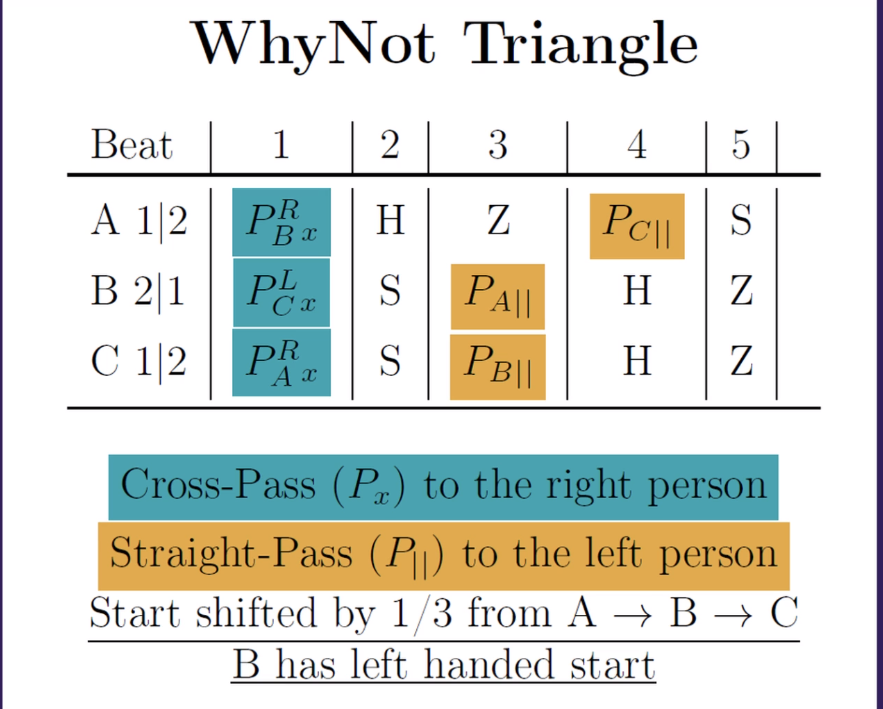

# Passing {-}

Passing patterns! Yay!

## Manipulation {-}

### 3-person {-}

- 4-count Roundabout (standard)
  - [Chopabout](https://fb.watch/hQFJcdEfP0/)
  - [Slapabout](https://youtu.be/hQUMouImUaI)
  - [3-count Roundabout (Nickie's version)](https://passing.zone/nickis-3-count-roundabout/)
- [Phoenician Waltz](https://passing.zone/phoenician-waltz/) (pps, symmetrical)
- [MinuEd](https://passing.zone/minued/) (pps, symmetrical)
- [Dolby 5.1](https://passing.zone/dolby-5-1-mit-einzel-und-doppelganger/) (5-count based)
- [ChampV](https://passing.zone/champ-v/) (ppsps, symmetrical)
  - All chops thrown from the same side (north wall pattern)
- [Why-not about (2014 version)](https://www.instagram.com/reel/Cm8Cam2u3tz/)
  - p3p41, the 4 gets intercepted
  - Alt. name: "What's that about?" :)

### 4-person {-}

- Kennedy (4-count roundabout with 2 manipulators, [helicopter version](https://passing.zone/kennedy-helicopter-version/))
- Scramble-V (Variations: 3,B,Toast,Zig-Zag)
- [Cambled-V](https://passing.zone/cambled-v/) 
  - Ambled-V variation
  - All start right-handed at the same time!
  - Feeder passes left-handed!
  - All passes are crossed!

### 5-person {-}

- Scramble-3V or Scramble-3ZigZag => 2-count 9-club feeds with runaround and 2 manipulators
- Shooting Star + 1 manipulator (or even 2)

## 2 jugglers {-}

Non-manipulation, non-moving patterns for 2 jugglers :)

### <5 clubs {-}

- 720 (501-like), 522 (3 clubs)
- 552 (4 clubs)

### 5 clubs {-}

- 1-count (singles or **zaps**)
- psz (726)
- 41p31 (why not)
- **Parsnip** (ppzpz)

With zaps:

- 645 (killer bunny => zap, flip, self)
- 852 (heff, zip, zap)
- [55258](https://passist.org/siteswap/55258?jugglers=2)
  - With Christian at Swedish passout (2022)
  - zap, zap, zap, zip, heff

### 6 clubs {-}

- 1,2,3,4-count, pyramid variations. Some fun names:
  - psss = vanilla
  - ppss = chocolate bar
  - ppps = strawberry
  - pppp = banana (1-count :)
- 3-count variations:
  - Early crossing double (on second throw)
  - 42p
  - 520p(x) => feels similar to the above (5 is like 4x)
- pps, ppsps (**bookends**)
  - pps with 2 early doubles: pp(dp)(dp)13-pps
- Jim's 2-count: 77466
- Jim's 3-count: 77466666
- **Why not** - [77862](https://passist.org/siteswap/77862?jugglers=2)
  - 2|2 vs 1|2: p3p41 (||) vs 41p3p (x)
  - 1|2 vs 1|2: p41p3 (||) vs p3p41 (x)
  - Straight-passes-person (||) always starts first!
  - Add an early double (Katia's idea): p(dp)241 (p => ||, dp => x) - [92478](https://passist.org/siteswap/92478?jugglers=2)
- **Maybe** - [78672](https://passist.org/siteswap/78672?jugglers=2)
  - 1|2 v2 1|2: p314p (||,1st) vs 4pp31 (x,2nd)
- **Not likely** - [96672](https://passist.org/siteswap/96672?jugglers=2)
  - 1|2 vs 1|2: (dp)313p (x => dp) vs 3p(dp)31 (x => single)
- **5 club Why Not?** vs **5-count Popcorn**
  - 1|2 vs 1|2: p3141 (||,1st) vs 44p33 (x,2nd)
- **Parsnip** vs **funky bookends**
  - 1|2 vs 1|2: ppzpz (||,1st) vs p4pp3 (x,2nd)
- [855](https://passist.org/siteswap/855?jugglers=2) - (heff, zap, zap)
- [972](https://passist.org/siteswap/972?jugglers=2)
  - 1|2 vs 1|2: (dp)1p (x,||, don't do the zip!) vs p(dp)1 (x,||)
  - (dp) => double pass
  - Pattern feels like two passes - p(dp) - that both end up **on the same hand**
- [45678](https://passist.org/siteswap/78456?jugglers=2)
  - All throws from flip to heff!
- [978822](https://passist.org/siteswap/978822?jugglers=2), 441's
  - 1|2 vs 1|2: (dp)41 (x,1st) bs p41 (x,2nd)

### 7 clubs {-}

- 1-count (singles)
- 2-count - s(dp) or sp (single passes)
- 3-count
  - Async version (doubles): ss(dp) - (||,1st) vs (x,2nd)
  - Sync version (**Techno**, singles): (RH p, LH 3)(RH 3)(LH p, RH 3)(LH 3) - (||,1st), (x,2nd)
- **5-count popcorn** - 78686
  - 2|2| vs 1|2: p3344 (||) vs 44p33 (x)
  - 53p33 (4-count popcorn) - 5 as double, single pass
- **French 3-count** - 786
  - 2|2 vs 1|2: p34 (||) vs 4p3 (x)
- **Funky Bookends** - 77786
  - 2|2 vs 1|2: pp3p4 (||) vs p4pp3 (x)
- **Vitoria** - 7778686
  - 2|2 vs 1|2: pp33p44 (||) vs p44pp33 (x)
- 88892 (nice with 441, but somewhat difficult)
  - 1|2 vs 2|2: 4414d (x,1st) vs 4d441 (||,2nd)
- **7 club why not** - 9968926
  - 2|2 vs 1|2: d3d3d41 (x) vs d41d3d3 (||)
- Nice 6-period siteswaps:
  - [678894](https://passist.org/siteswap/678894?jugglers=2) - 534 vs 423 kind-of
  - [999942](https://passist.org/siteswap/999942?jugglers=2) - train your doubles :)

## 3+ jugglers {-}

Non-manipulation patterns for 3 or more jugglers \\(\*0\*)\/

### 3 jugglers {-}

#### 9-clubs {-}

**Feeds**

- **2-count 9-club feed** 
  - Var: Runaround (when the feeder changes - base pattern for Scramble-V)
- **pps 9-club feed**
  - Var: Runaround (the person who walks does a 4-count, the feeder does a 2-count with the same person that is not moving, the future feeder does sp (2-count) + psppspps...
- **1-count chocolate bar feed**
  - Feeder does 1-count, 2 straight passes in one feeder, 2 in the other
  - Feeders do ppss (one starts two beats later or with ss)
- **Parsnip feeding** 7-club 5-count popcorn and 6-club why-not
  - Feeder right-throws to left person (5-count popcorn) and then 2 passes to the why-not feedee (all straight) => ppzpz
  - Everyone starts with **right hand**
  - Feeder => straight passes, **feedees => crossing passes**
  - Why-not feedee does p41p3 (crossing single passes, starts right-hand)
- **1-count feast**
  - Everyone does pps out-of-phase
- **ppz feeds french 3-count**
  - All passes straight
  - Feeders do 4p3, one starts with the left hand
  - Feeder passes in,in,out,out
- [Bruno's Nightmare (3-count version)](https://www.passingdb.com/patterns.php?id=48)
  - A giant juggles 3 jugglers (2 do 6-count, one feeds in 3-count and they change
roles)
  
**Triangles**

- 3-count triangle (in/out/in&out)
- pps triangle (in/out/in&out)
- Why-Not Triangle

#### 10 clubs {-}

- **2-count 10-club feed**  
  - Var: Runaround (when the feeder changes - base pattern for Ample-V)
Feeder does a 2-count to the same person when the other juggler does the 
runaround part. The runaround can be: 3 slow selfs, 1 double self + 2 normal 
for example (you have to fill 5 bits of time in there :)
- **6-club why-not feeds 2 x 7-club 5-count popcorns**  
  - Everyone starts **right-handed**
  - Feeder has 4 clubs, does p3p41, doesn't matter with whom he starts, **passes are straight**
  - Feedees do 44p33, **crossing passes**

#### 11 clubs {-}

- **pps 10-club feed** (996 vs 2x966)  
  - Feeder: pps (out,out,in,in - like in the 9-club version), starts with 5 clubs.
  - Feedees: 3-count, crossing

#### 6-handed siteswaps {-}

- Experimental, tried: [a37979999](https://passist.org/siteswap/a37979999?jugglers=3)

### 4 jugglers {-}

- Square placement, 2 jugglers work as **2-count feeders**, the 2 others do 
**4-count** as simple feedees
- **Shooting star** (single passes, one juggler runs to the extra corner of the 
pentagram when he rans out of clubs)
- **Y** (2-count mostly, can be 4-count). Variations:
  - **Rotating Y**  
Always moving clockwise, both groups change position every n passes (2 or 3 
usually), always pass and receive from the same juggler as before
  - Boxy-I Y (coolest variation of Y)  
US vs THEM, always moving clockwise, every n passes (2 or 3 usually) of 4-count 
ONLY one group changes position, at every moving one group (only) of jugglers 
changes the jugglers that they pass at, so generally you pass to both of the 
other group (but this is true only for one of the groups, the other does not 
change to whom they pass at). Each juggler in the group moves in a 
diamond-shaped path!
- **Weaver**  
Feeder: 2-count and feeds like a windshield 3 people  
Feedees: 6-count and moving as a 3-people cascade

### 5 jugglers {-}

- **2,3,4-count Star**  
  - Pentagram positioning
  - Throw to the person that's right-next to the person that's right of you! 
  - In 3-count, throws are *outside*
- **Feast**  
  - Pentagram positioning, 4-count
  - Each time throw a pass to a different person's left hand (I mean do a 
4-count with different person each time, following the circle orientation) - 
find next person by going clockwise, start by throwing to the person on your left
  - Throw sequence could be vanilla, chocolate bar, banana and generally 
different kind of passes between each person (but have to be in a 4-count)
- **Hand-feast (nice)**  
  - Pentagram positioning, 4-count
  - Each time throw a pass to a different hand in the circle going clockwise,
when it is time to throw to your hands, 'throw' a self, feels like Jim's
- **5-count Star with doubles (and 16 clubs)**  
  - Pentagram positioning, 5-count
  - Double passes
  - 16 clubs (one person holds 4 clubs and starts throwing in the 1st beat)
  - In each beat a different person throws a double (5 beats in total)
  - Throw **crossing passes** to the same person (the same person you would throw
if you were doing a 4-count Star). Your right hand pass goes to his right hand,
etc.

## Minis {-}

### Clubs {-}

Mostly **side-by-side**

#### 4 clubs {-}

- 42p11p  
  - '4' are all 'alone' (one in each juggler's hand)
  - 2p: get it up in the air and leave it to fall
  - 1p: give it to the hand of the other juggler that does a '4'
  - Variation: change the roles of the two hands in each juggler and 2p becomes a front plane flat quick throw
- 2p3p12  
  - '2p' is the same club and goes up and down
  - '3p' can be a front flat throw

#### 5 clubs {-}

- [413p2](https://www.instagram.com/p/BsHEZpyA8Ii/?utm_source=ig_web_copy_link)  
3p: front half flat from outside hand to inside hand of the other juggler,
can be chest tipping (filmed with Doreen)
- [332p2](https://www.instagram.com/p/BsKwDn7gMFs/?utm_source=ig_web_copy_link)  
Second 3 as chest tip, 2p as 'reverse' chest tip, 2 reverse active high catch
(filmed with Doreen)

### Balls {-}

Mostly **face-to-face**

#### 3 Balls {-}

- 1p (|| vs x)
- 311p (|| vs x)
  - [3 person version](https://youtu.be/GC_fLpkLye8?t=68) - always straight passes to the person in your left
- 1.5p12 (423)
- 311p1 (||)

#### 4 Balls {-}

- 311p3p (||)
- 312 variations: 3p12,31p2,312p,...,3p1p2p!!!

#### 5 Balls {-}

- [Partner Arm Weave Columns](https://youtu.be/KVxZmKU21W0?t=116)
